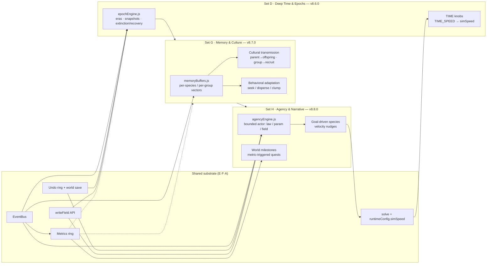

# mermaid.md — D·G·H Trilogy Architecture

```mermaid
flowchart LR
  subgraph SUB["Shared substrate (E·F·A)"]
    BUS[EventBus] --> MET[Metrics ring]
    UNDO[Undo ring + world save]
    WRITE[writeField API]
    SIM[solve + runtimeConfig.simSpeed]
  end

  subgraph D["Set D · Deep Time & Epochs — v8.6.0"]
    EP[epochEngine.js<br/>eras · snapshots · extinction/recovery]
    TIME[TIME knobs<br/>TIME_SPEED → simSpeed]
  end

  subgraph G["Set G · Memory & Culture — v8.7.0"]
    MEM[memoryBuffers.js<br/>per-species / per-group vectors]
    CULT[Cultural transmission<br/>parent→offspring · group→recruit]
    ADAPT[Behavioral adaptation<br/>seek / disperse / clump]
  end

  subgraph H["Set H · Agency & Narrative — v8.8.0"]
    AG[agencyEngine.js<br/>bounded actor: law / param / field]
    GOAL[Goal-driven species<br/>velocity nudges]
    MS[World milestones<br/>metric-triggered quests]
  end

  BUS --> EP & MEM & AG
  UNDO --> EP
  UNDO --> AG
  WRITE --> EP
  WRITE --> AG
  SIM --> TIME
  MET -.-> EP
  MET -.-> G
  MEM --> CULT
  MEM --> ADAPT
  MET --> MS
  AG --> GOAL
  GOAL --> SIM
  EP --> G
  G --> H
```
