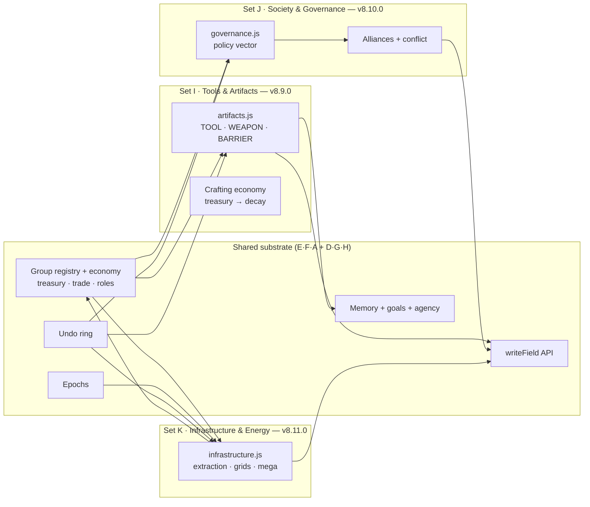

# mermaid.md — I·J·K Trilogy Architecture

```mermaid
flowchart LR
  subgraph SUB["Shared substrate (E·F·A + D·G·H)"]
    GR[Group registry + economy<br/>treasury · trade · roles]
    WRITE[writeField API]
    UNDO[Undo ring]
    MEM[Memory + goals + agency]
    EP[Epochs]
  end

  subgraph I["Set I · Tools & Artifacts — v8.9.0"]
    ART[artifacts.js<br/>TOOL · WEAPON · BARRIER]
    CRAFT[Crafting economy<br/>treasury → decay]
  end

  subgraph J["Set J · Society & Governance — v8.10.0"]
    GOV[governance.js<br/>policy vector]
    REL[Alliances + conflict]
  end

  subgraph K["Set K · Infrastructure & Energy — v8.11.0"]
    INF[infrastructure.js<br/>extraction · grids · mega]
  end

  GR --> ART
  GR --> GOV
  GR --> INF
  ART --> WRITE
  ART --> MEM
  GOV --> REL
  REL --> WRITE
  INF --> WRITE
  INF --> GR
  EP --> INF
  UNDO --> ART & GOV & INF
```
