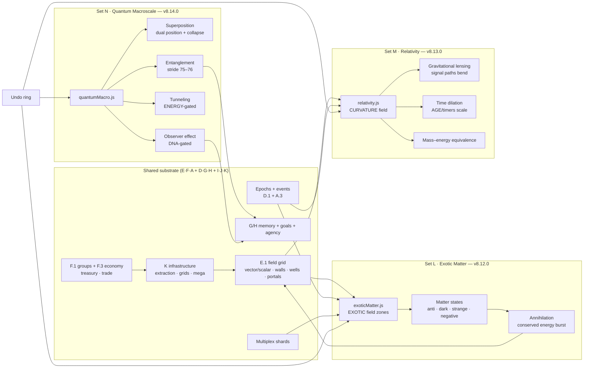

# mermaid.md — L·M·N Trilogy Architecture

```mermaid
flowchart LR
  subgraph SUB["Shared substrate (E·F·A + D·G·H + I·J·K)"]
    FLD[E.1 field grid<br/>vector/scalar · walls · wells · portals]
    GRP[F.1 groups + F.3 economy<br/>treasury · trade]
    MEM[G/H memory + goals + agency]
    EP[Epochs + events<br/>D.1 + A.3]
    INF[K infrastructure<br/>extraction · grids · mega]
    MUX[Multiplex shards]
  end

  subgraph L["Set L · Exotic Matter — v8.12.0"]
    EXO[exoticMatter.js<br/>EXOTIC field zones]
    STATE[Matter states<br/>anti · dark · strange · negative]
    ANN[Annihilation<br/>conserved energy burst]
  end

  subgraph M["Set M · Relativity — v8.13.0"]
    REL[relativity.js<br/>CURVATURE field]
    LENS[Gravitational lensing<br/>signal paths bend]
    DIL[Time dilation<br/>AGE/timers scale]
    EQ[Mass–energy equivalence]
  end

  subgraph N["Set N · Quantum Macroscale — v8.14.0"]
    QM[quantumMacro.js]
    SUP[Superposition<br/>dual position + collapse]
    ENT[Entanglement<br/>stride 75–76]
    TUN[Tunneling<br/>ENERGY-gated]
    OBS[Observer effect<br/>DNA-gated]
  end

  FLD --> EXO
  FLD --> REL
  EXO --> STATE
  STATE --> ANN
  ANN --> FLD
  REL --> LENS
  REL --> DIL
  REL --> EQ
  QM --> SUP
  QM --> ENT
  QM --> TUN
  QM --> OBS
  ENT --> MEM
  OBS --> MEM
  EP --> EXO
  EP --> REL
  MUX --> EXO
  GRP --> INF
  INF --> FLD
  UNDO["Undo ring"] --> EXO & REL & QM
```
