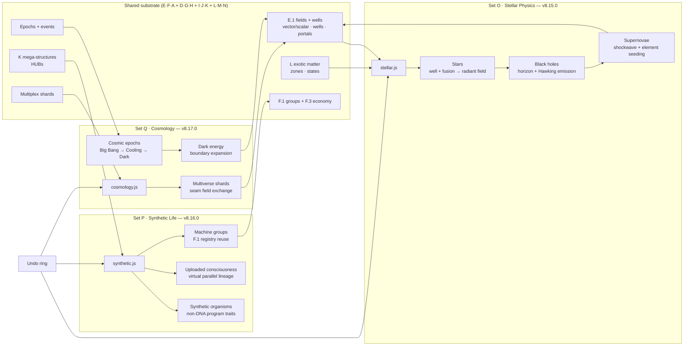

# mermaid.md — O·P·Q Trilogy Architecture

```mermaid
flowchart LR
  subgraph SUB["Shared substrate (E·F·A + D·G·H + I·J·K + L·M·N)"]
    FLD[E.1 fields + wells<br/>vector/scalar · wells · portals]
    EXO[L exotic matter<br/>zones · states]
    GRP[F.1 groups + F.3 economy]
    EP[Epochs + events]
    HUB[K mega-structures<br/>HUBs]
    MUX[Multiplex shards]
  end

  subgraph O["Set O · Stellar Physics — v8.15.0"]
    ST[stellar.js]
    STAR[Stars<br/>well + fusion → radiant field]
    BH[Black holes<br/>horizon + Hawking emission]
    SN[Supernovae<br/>shockwave + element seeding]
  end

  subgraph P["Set P · Synthetic Life — v8.16.0"]
    SYN[synthetic.js]
    ORG[Synthetic organisms<br/>non-DNA program traits]
    UPL[Uploaded consciousness<br/>virtual parallel lineage]
    MGR[Machine groups<br/>F.1 registry reuse]
  end

  subgraph Q["Set Q · Cosmology — v8.17.0"]
    COS[cosmology.js]
    MV[Multiverse shards<br/>seam field exchange]
    CE[Cosmic epochs<br/>Big Bang → Cooling → Dark]
    DE[Dark energy<br/>boundary expansion]
  end

  FLD --> ST
  EXO --> ST
  ST --> STAR
  STAR --> BH
  BH --> SN
  SN --> FLD
  HUB --> SYN
  SYN --> ORG
  SYN --> UPL
  SYN --> MGR
  MGR --> GRP
  MUX --> COS
  COS --> MV
  MV --> FLD
  EP --> CE
  CE --> DE
  DE --> FLD
  UNDO["Undo ring"] --> ST & SYN & COS
```
