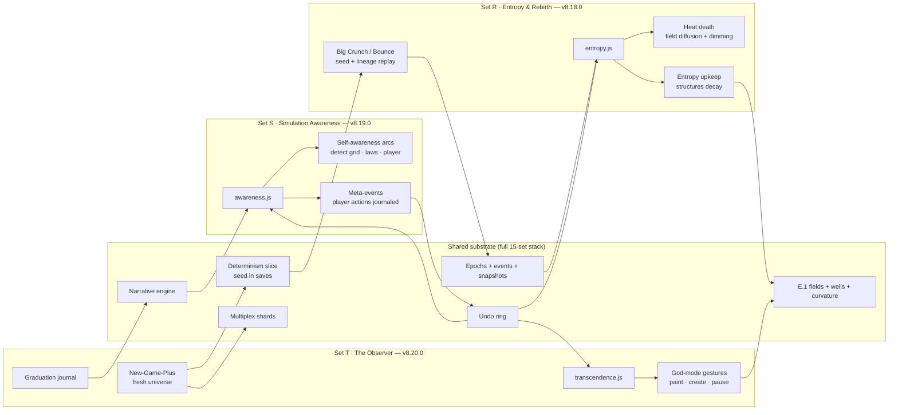

# mermaid.md — R·S·T Trilogy Architecture

```mermaid
flowchart LR
  subgraph SUB["Shared substrate (full 15-set stack)"]
    FLD[E.1 fields + wells + curvature]
    EP[Epochs + events + snapshots]
    NAR[Narrative engine]
    UNDO[Undo ring]
    SEED[Determinism slice<br/>seed in saves]
    MUX[Multiplex shards]
  end

  subgraph R["Set R · Entropy & Rebirth — v8.18.0"]
    ENT[entropy.js]
    HD[Heat death<br/>field diffusion + dimming]
    CR[Big Crunch / Bounce<br/>seed + lineage replay]
    EF[Entropy upkeep<br/>structures decay]
  end

  subgraph S["Set S · Simulation Awareness — v8.19.0"]
    AW[awareness.js]
    SA[Self-awareness arcs<br/>detect grid · laws · player]
    ME[Meta-events<br/>player actions journaled]
  end

  subgraph T["Set T · The Observer — v8.20.0"]
    TR[transcendence.js]
    GM[God-mode gestures<br/>paint · create · pause]
    GR[Graduation journal]
    NGP[New-Game-Plus<br/>fresh universe]
  end

  EP --> ENT
  ENT --> HD
  SEED --> CR
  CR --> EP
  ENT --> EF
  EF --> FLD
  NAR --> AW
  AW --> SA
  AW --> ME
  ME --> UNDO
  TR --> GM
  GM --> FLD
  GR --> NAR
  NGP --> SEED
  NGP --> MUX
  UNDO --> ENT & AW & TR
```
