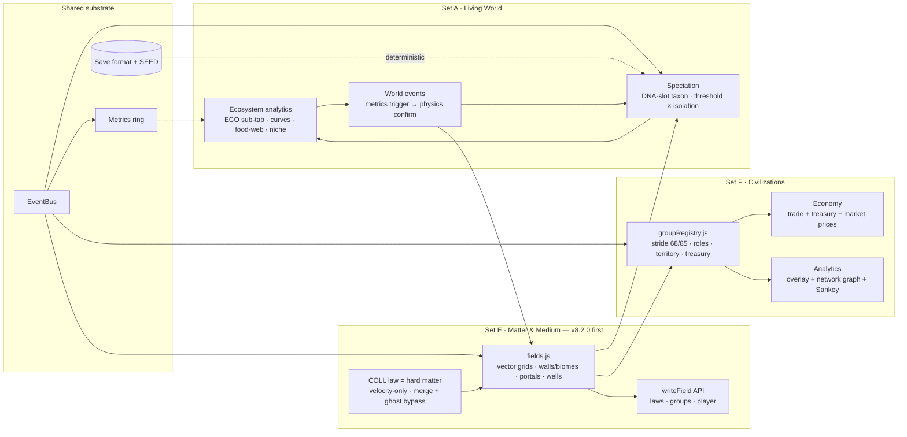

# mermaid.md — E·F·A Trilogy Architecture

```mermaid
flowchart LR
  subgraph SUB["Shared substrate"]
    BUS[EventBus] --> MET[Metrics ring]
    SAV[(Save format + SEED)]
  end

  subgraph E["Set E · Matter & Medium — v8.2.0 first"]
    FL[fields.js<br/>vector grids · walls/biomes · portals · wells]
    COLL[COLL law = hard matter<br/>velocity-only · merge + ghost bypass]
    WRITE[writeField API<br/>laws · groups · player]
  end

  subgraph F["Set F · Civilizations"]
    GR[groupRegistry.js<br/>stride 68/85 · roles · territory · treasury]
    ECON[Economy<br/>trade + treasury + market prices]
    VIEW[Analytics<br/>overlay + network graph + Sankey]
  end

  subgraph A["Set A · Living World"]
    SP[Speciation<br/>DNA-slot taxon · threshold × isolation]
    ECO[Ecosystem analytics<br/>ECO sub-tab · curves · food-web · niche]
    EV[World events<br/>metrics trigger → physics confirm]
  end

  BUS --> FL & GR & SP
  SAV -. deterministic .-> SP
  FL --> WRITE
  FL --> GR
  FL --> SP
  COLL --> FL
  GR --> ECON
  GR --> VIEW
  SP --> ECO
  ECO --> EV
  EV --> FL
  EV --> SP
  MET -.-> ECO
```
