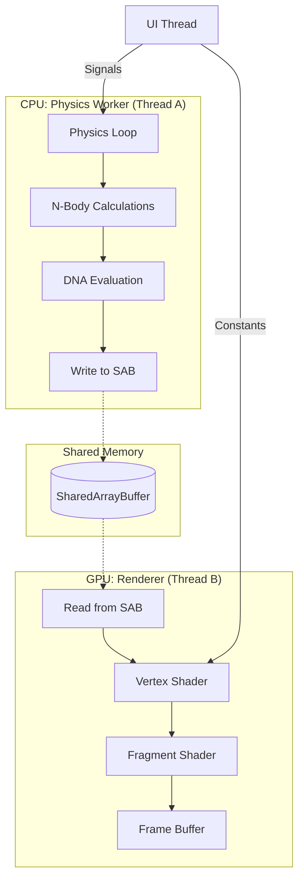

# Architectural Foundation: The High-Performance 3D Manifold

## The 3D Manifold substrate
The VEPA system is architected upon a high-performance 3D manifold (2000 x 2000 x 1000), serving as the fundamental computational substrate for synthetic cosmology. This architecture transforms the simulation from a collection of "objects with rules" into a continuous physics field where every interaction is a byproduct of the environment's internal logic.

### Engineering Requirements
Transitioning from 2D planes to 3D perspective projection necessitates several performance-critical rendering components:
* **Depth-Based Clustering:** Logic to manage and render complex orbital structures and high-density particle swarms within a volumetric space.
* **Atmospheric Alpha Fading:** Utilization of transparency gradients to provide visual depth cues and represent the density of the medium.
* **Size-Scaling:** Dynamic adjustment of particle rendering based on distance from the observer.

## The 24-Word Memory Stride
To maximize computational throughput, VEPA utilizes a custom-aligned 24-word memory stride. This enforces "thermodynamic locality" for evolutionary gradients; by caching genomic traits directly into the particle stride, each agent becomes a stateful biological instruction packet.

### Memory Index Mapping
The following table details the 24-word layout (0x00 to 0x5C) utilized within the `SharedArrayBuffer`:

| Offset | Parameter | Description |
| :--- | :--- | :--- |
| 0x00 | Position_X | Spatial coordinate (X-axis) |
| 0x04 | Position_Y | Spatial coordinate (Y-axis) |
| 0x08 | Position_Z | Spatial coordinate (Z-axis) |
| 0x0C | Species_ID | Unique identifier for genetic lineage |
| 0x10 | Velocity_X | Kinetic vector (X-axis) |
| 0x14 | Velocity_Y | Kinetic vector (Y-axis) |
| 0x18 | Velocity_Z | Kinetic vector (Z-axis) |
| 0x1C | Mass | Scalar property for gravity/inertia calculations |
| 0x20 | DNA_Cache_0 | Force Parameter (Fundamental attraction/repulsion) |
| 0x24-0x58 | DNA_Cache_1–14 | 14 slots for traits (Inertia, Friction, Max Velocity, Elasticity, etc.) |
| 0x5C | DNA_Cache_15 | Memory Decay (DNA Parameter 41) |

## Data Flow Architecture
The interaction between the CPU, GPU, and the Shared memory space is visualized below:

## Core Physics Constraints
The manifold operates under specific mathematical laws that define the "Physicality" of the simulation.

### 1. Unified Force Accumulation
The total force $F_{total}$ on a particle $i$ is calculated as the sum of gravitational, electrical, and tidal stressors:
$$F_{total} = \sum_{j \neq i} \left( \frac{G \cdot m_i \cdot m_j}{r_{ij}^2} + \frac{k \cdot q_i \cdot q_j}{r_{ij}^2} \right) \cdot \hat{r}_{ij}$$
Where $r_{ij}$ is the distance between particles and $\hat{r}_{ij}$ is the unit vector.

### 2. Tidal Stress & Fragmentation
Tidal stress $\sigma_t$ is applied when a cluster enters the Roche Limit of a high-mass entity or a VOID_CORE:
$$\sigma_t \approx \frac{2 \cdot G \cdot M \cdot R}{d^3}$$
If $\sigma_t$ exceeds the **Elasticity DNA** parameter, the cluster undergoes fragmentation.

## SharedArrayBuffer Utilization
The `SharedArrayBuffer` serves as the primary bridge between the CPU physics worker and the GPU renderer. This zero-copy structure allows the physics thread to update particle positions, velocities, and DNA states in a shared memory space that the GPU can access with minimal latency. This architecture is the only viable path for sustaining a 60FPS simulation loop while handling 42 distinct DNA parameters per particle.
