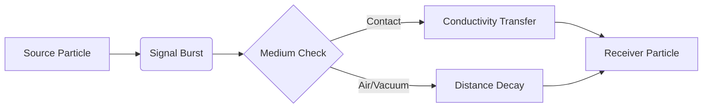

# Proto-Neural Communication and Signaling Architecture

VEPA implements a 4-channel signaling layer that enables "Resonance Intelligence." By allowing species to communicate internal states, the system moves beyond physics into proto-computation, where synchronization functions as a form of collective intelligence.

## Signal Tuning Specifications
The system utilizes a 4-Channel Tuning requirement (Ch1–Ch4), allowing species to develop sensitivities to specific frequencies (e.g., threat detection on Ch2, social clustering on Ch1).

* **Signal Decay:** Controls the localization of the "memory field."
* **Propagation Speed:** Determines the rate of global synchronization and phase-alignment.
* **Conductivity:** Governs how signals pass through physical contact.

## Conductivity Circuits
The conductivity mechanic allows signals to pass through physical contact, turning rigid particle clusters into analog circuits or logic gates. This enables the emergence of **Topological Organisms**—living geometry such as filament colonies or distributed membranes that act as unified, information-preserving systems.

## Signal Propagation Model
Signals propagate through the manifold as a time-decaying field. The intensity $I$ at distance $r$ and time $t$ follows a localized diffusion model:



## Conductivity Circuits (Technical Implementation)
The conductivity mechanic is implemented as a direct state transfer between colliding or adjacent particles:

```javascript
// Signal Transfer Logic
function updateConductivity(p1, p2) {
    if (distance(p1, p2) < CONTACT_THRESHOLD) {
        const transferAmount = p1.signalStrength * p1.dna[SOCIAL_CONDUCTIVITY];
        p2.signalStrength += transferAmount;
        
        // Potential Resonance Intelligence Check
        if (p2.signalStrength > RESONANCE_THRESHOLD) {
            triggerPhaseAlignment(p1, p2);
        }
    }
}
```

## Resonance Computation
The culmination of these systems is "Resonance Computation," where signal persistence and coordination efficiency converge to reduce local entropy. These persistent, low-entropy structures represent the core of the "Synthetic Cosmogenesis Platform," where physics-born information systems exhibit behaviors analogous to primitive nervous systems.
